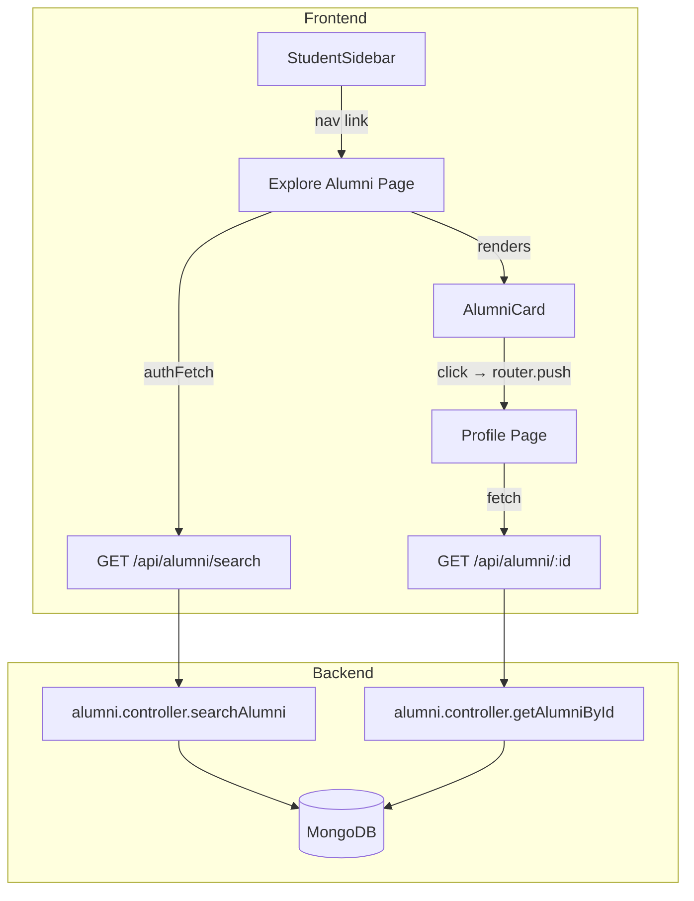

# Design Document: Alumni Search and Discovery

## Overview

The Alumni Search and Discovery feature adds a browsable, searchable alumni directory to the student-facing side of AlumniConnect. Students can discover alumni mentors by filtering on name, college, company, job title, and skills. The feature consists of:

- A backend search API (`GET /api/alumni/search`) with optional auth-aware college filtering
- A public profile API (`GET /api/alumni/:id`) returning alumni details and upcoming sessions
- An Explore Alumni page (`/student/explore-alumni`) with debounced search, skeleton loading, and a responsive card grid
- A reusable `AlumniCard` component
- A public alumni profile page (`/student/alumni/[id]`)
- A StudentSidebar update adding the "Explore Alumni" nav item

The feature is read-only from the student's perspective — no booking logic is implemented.

---

## Architecture



**Request flow for search:**
1. Student loads Explore page → `authFetch` sends GET `/api/alumni/search` with JWT
2. Optional auth middleware decodes token if present, attaches `req.user`
3. `searchAlumni` builds a `$regex` query from provided params; falls back to college filter if authed with no params
4. Results are populated with User `name` and `college`, optionally sorted, and returned

**Request flow for profile:**
1. Student clicks an AlumniCard → navigates to `/student/alumni/[id]`
2. Page fetches GET `/api/alumni/:id` (no auth required)
3. Controller returns alumni doc, user doc, and scheduled sessions sorted by `startTime`

---

## Components and Interfaces

### Backend

#### `alumni.controller.js` — new exports

```js
// searchAlumni(req, res)
// GET /api/alumni/search
// Query params: name, college, company, jobTitle, skills, sort
// Optional auth via optionalAuth middleware

// getAlumniById(req, res)
// GET /api/alumni/:id
// No auth required
```

#### `alumni.routes.js` — new routes (added BEFORE parameterized routes)

```js
router.get("/search", optionalAuth, searchAlumni);
router.get("/:id", getAlumniById);
```

The `optionalAuth` middleware decodes the JWT if present but calls `next()` regardless, setting `req.user` only when a valid token exists.

#### Optional Auth Middleware

A new inline or separate middleware that wraps the existing `auth` middleware behavior but does not block unauthenticated requests:

```js
// optionalAuth(req, res, next)
// If Authorization header present and valid → set req.user, call next()
// If missing or invalid → call next() without setting req.user
```

### Frontend

#### `AlumniCard.js`

Props:
```js
{
  alumni: {
    _id,
    profileImage: { url },
    bio,
    company,
    jobTitle,
    skills,    // String[]
    rating,
    userId: { name, college }
  }
}
```

Renders: image, name, "JobTitle @ Company", up to 3 skill tags, star rating, truncated bio. Clickable — navigates to `/student/alumni/[alumni._id]`.

#### `explore-alumni/page.js`

State:
- `filters` — `{ name, college, company, jobTitle, skills }` object
- `sort` — `"rating" | "sessions" | ""`
- `alumni` — array of results
- `loading` — boolean

Behavior:
- On mount: fetch with auth token (default college filter via backend)
- On filter/sort change: 300ms debounce → rebuild query string → `authFetch` GET `/api/alumni/search`
- Renders skeleton cards while `loading`, grid of `AlumniCard` when done, empty state when `alumni.length === 0`

#### `alumni/[id]/page.js`

State:
- `alumni`, `user`, `sessions` — from API response
- `loading`, `notFound` — booleans

Behavior:
- On mount: fetch GET `/api/alumni/:id` (plain `fetch`, no auth needed)
- Renders header, stats, sessions list

---

## Data Models

### AlumniProfile (existing — `backend/models/Alumni.js`)

| Field | Type | Notes |
|---|---|---|
| `userId` | ObjectId → User | populated for name, college |
| `profileImage` | `{ url, filename }` | optional |
| `department` | String | |
| `batchYear` | Number | |
| `company` | String | searchable |
| `jobTitle` | String | searchable |
| `skills` | [String] | searchable |
| `bio` | String | displayed truncated on card |
| `rating` | Number | sortable |
| `totalSessions` | Number | sortable |
| `about` | String | |
| `experiences` | [ObjectId] | not used in this feature |
| `projects` | [ObjectId] | not used in this feature |
| `achievements` | [ObjectId] | not used in this feature |

### User (existing — `backend/models/User.js`)

| Field | Type | Notes |
|---|---|---|
| `name` | String | populated in search/profile results |
| `college` | String | used for default college filter |
| `role` | String | |

### Session (existing — `backend/models/Session.js`)

| Field | Type | Notes |
|---|---|---|
| `alumniId` | ObjectId → AlumniProfile | filter by this |
| `title` | String | displayed |
| `startTime` | Date | sorted asc, formatted for display |
| `duration` | Number (minutes) | |
| `price` | Number | displayed |
| `maxSeats` | Number | available = maxSeats - currentSeats |
| `currentSeats` | Number | |
| `status` | `"scheduled" \| "completed" \| "cancelled"` | filter to "scheduled" only |

### Search Query Shape

```
GET /api/alumni/search?name=&college=&company=&jobTitle=&skills=&sort=rating
```

All params optional. `skills` is matched as a single string against the array using `$regex`.

### Profile Response Shape

```json
{
  "success": true,
  "alumni": { ...AlumniProfile fields },
  "user": { "name": "...", "college": "..." },
  "sessions": [ ...Session docs with status="scheduled", sorted by startTime asc ]
}
```

---

## Correctness Properties

*A property is a characteristic or behavior that should hold true across all valid executions of a system — essentially, a formal statement about what the system should do. Properties serve as the bridge between human-readable specifications and machine-verifiable correctness guarantees.*

### Property 1: Search filter results match provided params

*For any* combination of filter parameters (name, college, company, jobTitle, skills), every alumni returned by the Search API should satisfy all provided filters via case-insensitive partial match.

**Validates: Requirements 1.2**

### Property 2: Default search with auth returns same-college alumni only

*For any* authenticated student with a known college, calling the Search API with no filter params should return only alumni whose associated User has a matching college value.

**Validates: Requirements 1.3**

### Property 3: Search results always include populated user fields

*For any* search request, every alumni object in the response array should have a non-null `userId` field containing at minimum `name` and `college`.

**Validates: Requirements 1.5**

### Property 4: Sort ordering invariant

*For any* search response with `sort=rating`, each consecutive pair of results should satisfy `results[i].rating >= results[i+1].rating`. *For any* search response with `sort=sessions`, each consecutive pair should satisfy `results[i].totalSessions >= results[i+1].totalSessions`.

**Validates: Requirements 1.6, 1.7**

### Property 5: Profile API response shape and populated user

*For any* valid AlumniProfile `_id`, the Profile API should return a response with `success: true` and an object containing `alumni`, `user` (with `name` and `college`), and `sessions` fields.

**Validates: Requirements 2.1, 2.2**

### Property 6: Profile sessions are scheduled and ascending

*For any* alumni with sessions of mixed statuses, the Profile API should return only sessions with `status: "scheduled"`, and those sessions should be ordered by `startTime` ascending (each `sessions[i].startTime <= sessions[i+1].startTime`).

**Validates: Requirements 2.3**

### Property 7: AlumniCard renders required fields for any alumni

*For any* alumni object passed to `AlumniCard`, the rendered output should contain: an image element (profile image or placeholder), the alumni's name, the string "JobTitle @ Company", at most 3 skill tags (exactly `min(skills.length, 3)`), and the rating value.

**Validates: Requirements 4.1, 4.2, 4.3, 4.4**

### Property 8: AlumniCard click navigates to correct profile route

*For any* alumni card rendered with a given `_id`, clicking the card should trigger navigation to `/student/alumni/[_id]`.

**Validates: Requirements 4.6**

### Property 9: Profile page renders all required alumni data

*For any* alumni profile loaded by the Profile Page, the rendered output should include: profile image, name, job title, company, skills, bio, rating, total sessions count, upcoming sessions count, and for each session — title, formatted start date/time, price, available seats, and a "Book Session" button.

**Validates: Requirements 5.3, 5.4, 5.5**

### Property 10: Debounce — API called at most once per input burst

*For any* sequence of keystrokes within a 300ms window in the search/filter inputs, the Search API should be called exactly once (after the 300ms delay), not once per keystroke.

**Validates: Requirements 3.5**

### Property 11: Sidebar active state matches current route

*For any* route equal to `/student/explore-alumni`, the "Explore Alumni" sidebar item should have the active CSS class applied; for any other route, it should not.

**Validates: Requirements 6.3**

---

## Error Handling

### Backend

| Scenario | Response |
|---|---|
| DB error in `searchAlumni` | HTTP 500, `{ success: false, message: "Server error" }` |
| DB error in `getAlumniById` | HTTP 500, `{ success: false, message: "Server error" }` |
| Alumni not found by ID | HTTP 404, `{ success: false, message: "Alumni not found" }` |
| Invalid/missing JWT on search | Treated as unauthenticated — returns all alumni (no 401) |

### Frontend

| Scenario | Behavior |
|---|---|
| Search API fetch error | Show toast error, clear loading state |
| Profile API returns 404 | Render "Alumni not found" message |
| Profile API fetch error | Render error message |
| Alumni has no profile image | Render placeholder div/image |
| Alumni has no bio | Render empty string gracefully |
| Alumni has no skills | Render zero skill tags |

---

## Testing Strategy

### Unit Tests

Focus on specific examples, edge cases, and integration points:

- `searchAlumni` with no params + valid JWT returns only same-college alumni
- `searchAlumni` with no params + no JWT returns all alumni
- `searchAlumni` with `name` param returns only matching alumni
- `getAlumniById` with valid ID returns correct shape
- `getAlumniById` with unknown ID returns 404
- `AlumniCard` renders placeholder when `profileImage` is absent
- `AlumniCard` renders exactly 3 skill tags when alumni has more than 3 skills
- Profile page shows "Alumni not found" on 404 response
- "Book Session" button click does not trigger any fetch call

### Property-Based Tests

Use **fast-check** (JavaScript) for all property tests. Each test should run a minimum of **100 iterations**.

Each test must be tagged with a comment in the format:
`// Feature: alumni-search-discovery, Property N: <property text>`

**Property 1 — Search filter matching**
Generate random alumni records and random filter strings. For each filter param provided, assert every result contains the filter value (case-insensitive) in the corresponding field.
`// Feature: alumni-search-discovery, Property 1: search filter results match provided params`

**Property 2 — Default auth college filter**
Generate random students with a college and random alumni spread across colleges. Assert that calling search with auth and no params returns only alumni from the student's college.
`// Feature: alumni-search-discovery, Property 2: default search with auth returns same-college alumni only`

**Property 3 — Populated user fields**
Generate random search results. Assert every result has a non-null `userId` with `name` and `college` present.
`// Feature: alumni-search-discovery, Property 3: search results always include populated user fields`

**Property 4 — Sort ordering invariant**
Generate random alumni arrays. Assert that after sorting by `rating`, each consecutive pair satisfies `results[i].rating >= results[i+1].rating`. Repeat for `totalSessions`.
`// Feature: alumni-search-discovery, Property 4: sort ordering invariant`

**Property 5 — Profile API response shape**
Generate random valid alumni IDs. Assert the response has `success: true`, and contains `alumni`, `user` (with `name` and `college`), and `sessions`.
`// Feature: alumni-search-discovery, Property 5: profile API response shape and populated user`

**Property 6 — Profile sessions filter and order**
Generate alumni with sessions of mixed statuses and random startTimes. Assert only `status: "scheduled"` sessions are returned, and they are sorted ascending by `startTime`.
`// Feature: alumni-search-discovery, Property 6: profile sessions are scheduled and ascending`

**Property 7 — AlumniCard renders required fields**
Generate random alumni objects (varying skills count, presence/absence of profileImage). Assert the rendered card always contains an image element, name, "JobTitle @ Company" string, `min(skills.length, 3)` skill tags, and the rating.
`// Feature: alumni-search-discovery, Property 7: AlumniCard renders required fields for any alumni`

**Property 8 — AlumniCard click navigation**
Generate random alumni `_id` values. Render the card, simulate a click, and assert `router.push` was called with `/student/alumni/${_id}`.
`// Feature: alumni-search-discovery, Property 8: AlumniCard click navigates to correct profile route`

**Property 9 — Profile page renders all required data**
Generate random alumni + sessions data. Assert the rendered profile page contains all required fields for the header, stats, and each session row.
`// Feature: alumni-search-discovery, Property 9: profile page renders all required alumni data`

**Property 10 — Debounce**
Simulate N keystrokes within 300ms. Assert the Search API fetch is called exactly once after the debounce window, not N times.
`// Feature: alumni-search-discovery, Property 10: debounce — API called at most once per input burst`

**Property 11 — Sidebar active state**
Generate random route strings. Assert the "Explore Alumni" item has the active class if and only if the route is `/student/explore-alumni`.
`// Feature: alumni-search-discovery, Property 11: sidebar active state matches current route`
